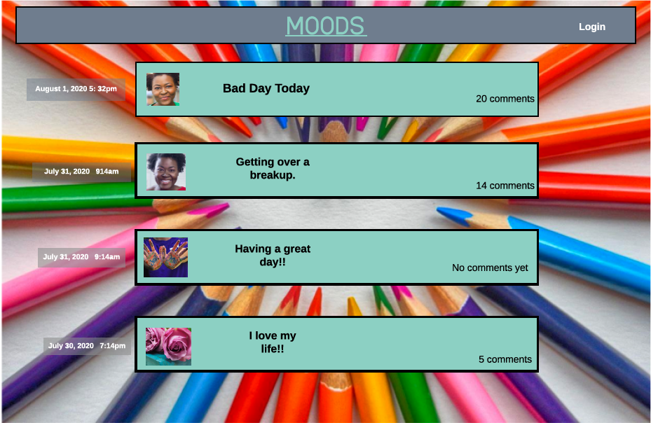
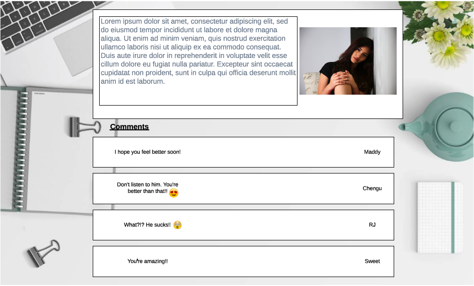
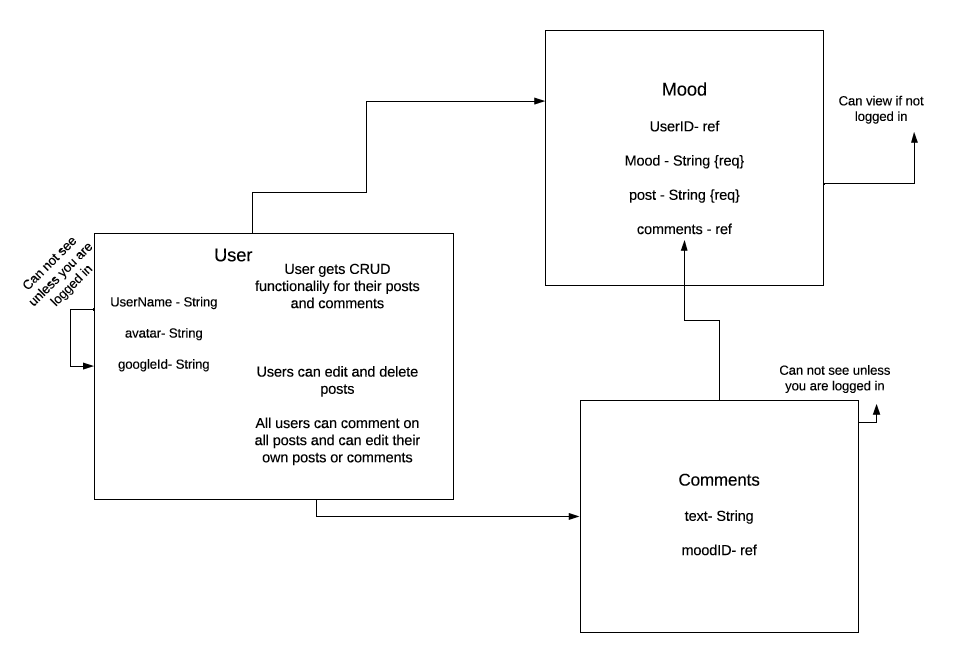
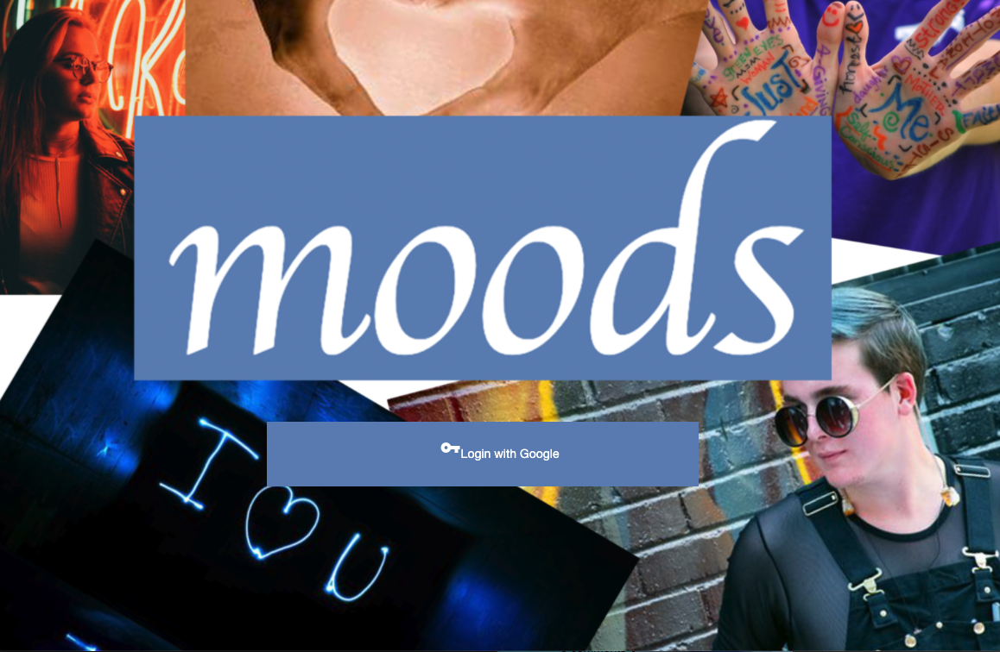
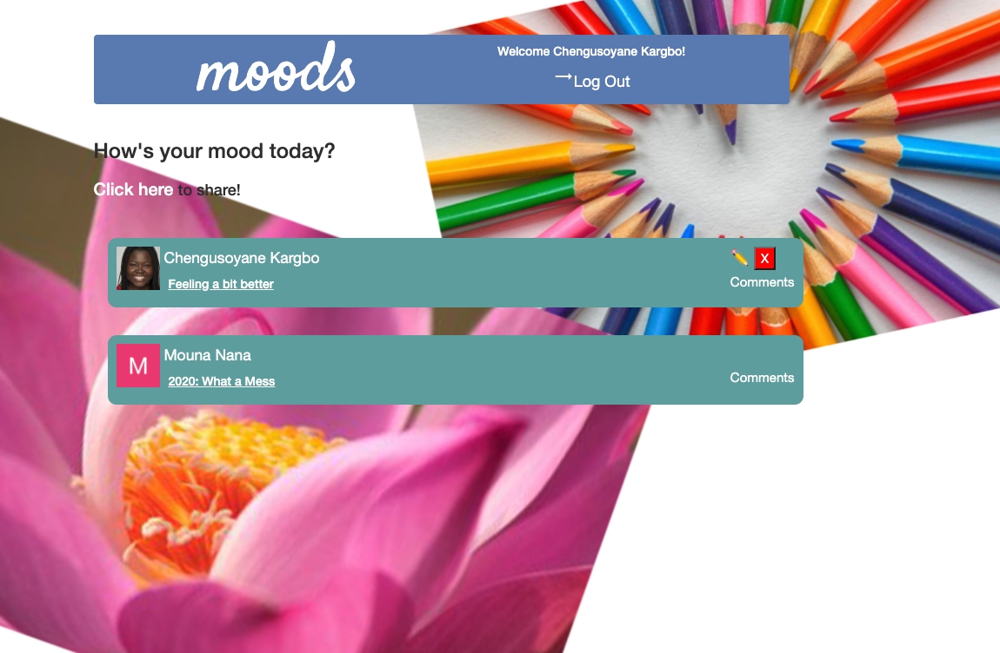
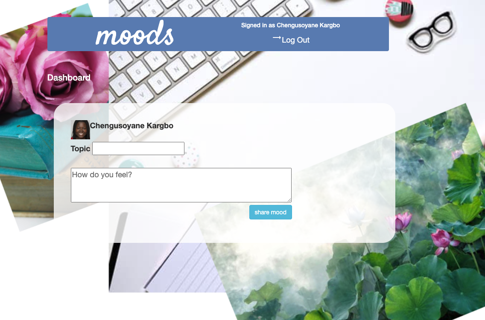
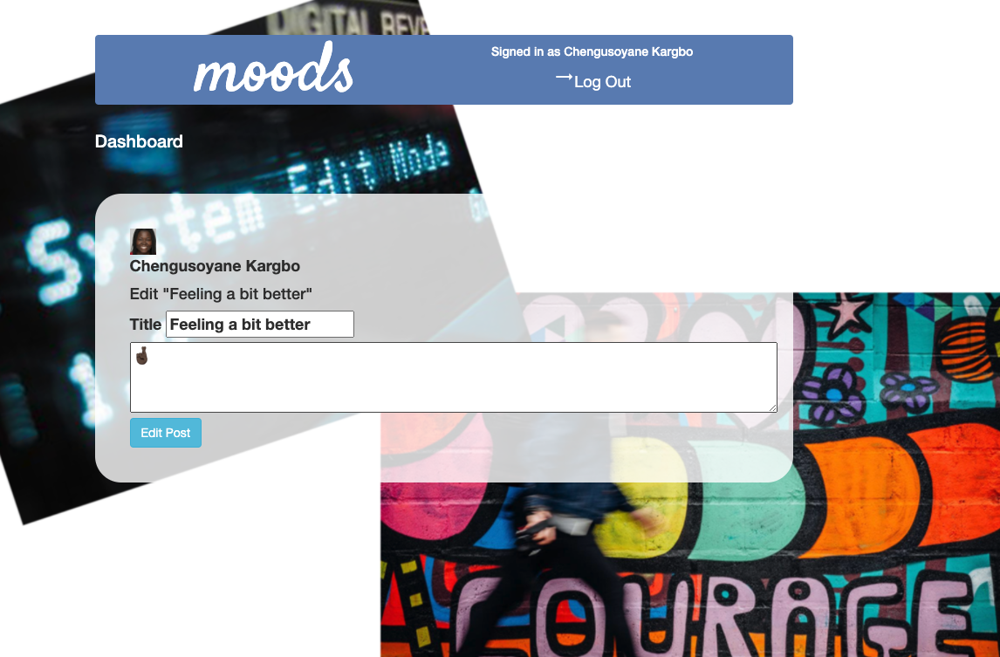
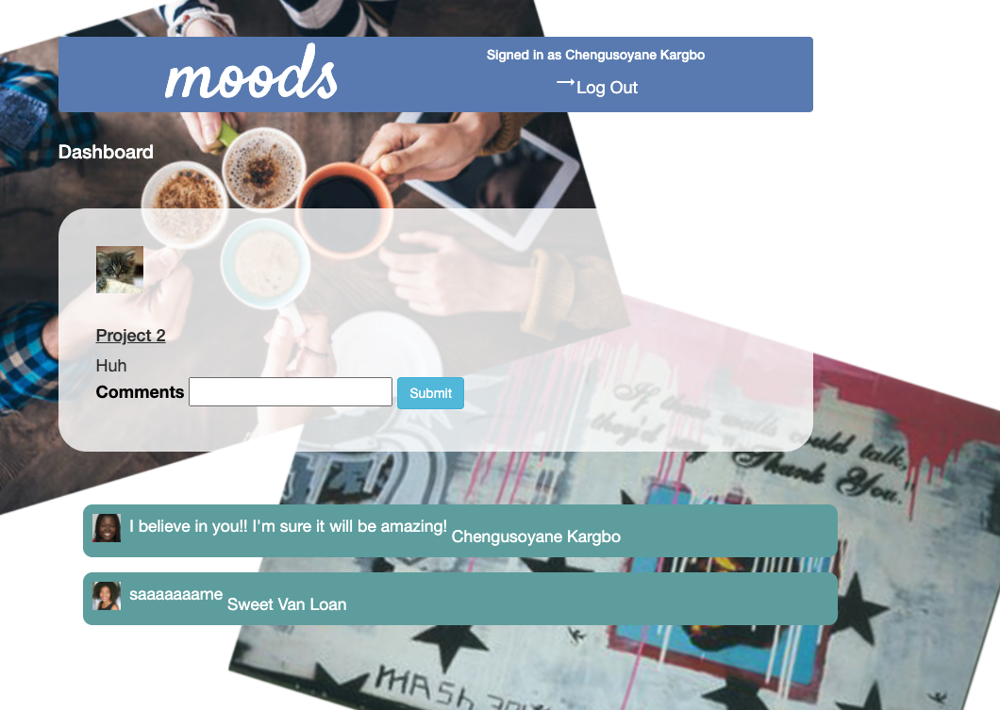

# Moods
## A blog for sharing your emotions and supporting one another.

My vision for this blog is that I want to have a place for people who want to share their moods. Where, if you’re having a hard time or had a great day, you can come to 'moods' and share what’s got you in a mood- share a gif that exemplifies your mood, post a picture - and get support from the commenters.

# Getting Started

To create this app, I used wireframes and Entity Relationship Diagram (ERD) (pictured below) as well as a Trello board (pictured below) as guides to help me establish and meet my goals. To deploy this app, you will need to open a coding program and install all required programs and set up Google's People Api to create Oath credentials.

# App Inspiration

I was inspired by conversations I've had with classmates who needed a person who could listen and hear their pain and stress as well as share in their celebrations. I know that a lot of people don't have a person like that in their lives so I wanted to build a place where they could go and get that support.

# Design inspiration

Within my vision for the app- the vision being building a community in a series of emotional moments- I felt like we would be building a scrapbook of us and our lives together. And I wanted to reflect that in the design. So the backgrounds look like pages out of a scrapbook and I think they enhance that feeling.

# Resolved Problem

The way I initially created my ERD (pictured below) and my models nested my data so much that accessing even the most basic information was difficutlt. It required every function to be incredibly intricate and long to access and change anything. One of our instructors taught me how to refactor my ERD and models to make my information more easily accessible. Which did mean I had to start over, but in the process, I learned so much more about how each part of the server communicated with each other part. So I am incredibly grateful for that setback. And that instructor.

# Wireframes

### Planned landing page

### Planned page to create new post

### Planned page to get comments from the community

# Entity Relationship Diagrams (ERD)

### Updated ERD

# Trello Board
### Current State- Most functionality is completed, but some extra special features are in the ice box as future goals.

# App Screenshots

### Landing Page

### See all users posts. User can comment on any post and edit or delete their own

### User can create a new post

### Page where user can edit their post

### Page where user can read other users post and comment

# Live Site

[Link to App](https://moodsblog.herokuapp.com/) to open app in browser.

# Technologies

* HTML
* CSS
* Javascript
* Bootstrap
* EJS
* Express
* Node.js
* Mongoose
* Google People Api
* Google Oath
* MongoDB
* Heroku

# Unsolved Problems

1. I was able to have full CRUD functionality on my moods (posts), but was not able to add the same functionality to my comments. I planned on allowing each user to post, edit and delete their comments, but ran into huge issues with mongo. It was creating a new user Id # for each user each time they signed in. The user Id # is how we identify one user from another so a user couldn't delete their comment if it was restricted to the user who posted it since according to the database, they were not that user. I was able to fix that error, but still could not figure out how to delete a comment. That is something I plan on working on in the future.

2. On my comments page, I planned and coded for the profile picture and user name of the user who posted the mood to appear along with their post. Unfortunately it will not appear so in it's place at this time, I have put a random kitten. I hope to make that work in the near future.

# Future Enhancements

In the future, I would like to add in the functions that I set out to include:

1. I would like the user to be able to add a gif to their post to exemplify their mood. There just wasn't enough time to look into that option.

2. I would like the user to be able to upload a picture to exemplify their experience if they feel the community might need that to understand their situation

3. I would also like the user to be able to change the font of their post. If another font works better to help them feel heard, I want them to be able to use it. 

# Authors
 Chengusoyane Kargbo - *Initial work* - [ChenguK](https://github.com/ChenguK)

# Acknowledgements
 Thank you to anyone whose code inspired me (all of SEI-R 629) and to all those who helped me create this site. Especially our amazing instructions!
